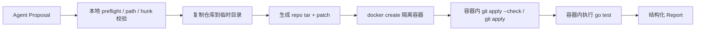

# CodeCoDriver Docker Sandbox

本文记录 Docker 沙箱的当前实现、隔离边界、配置方式和真实测试结果。

## 1. 目标

Test Agent 需要把模型生成的 patch 应用到一个临时仓库副本，并执行真实测试。实现目标不是把整个 Agent 主进程放进容器，而是把最不可信的步骤（任意 patch 内容和任意测试命令）放进隔离容器：

1. 原始仓库不会被沙箱测试命令修改。
2. 测试命令没有网络、root 权限和 Docker 能力，默认无法逃逸。
3. patch 必须先 apply 成功，再跑测试；`applied=true` 和 `passed=true` 分开记录。
4. 失败时保留可审计的 sandbox report，供 Review Agent 和评测系统使用。

当前 Agent 主进程仍运行在宿主或 API 容器中；Docker sandbox 只隔离 patch 验证和测试执行。

## 2. 实现位置

| 模块 | 作用 |
|---|---|
| `internal/sandbox/docker.go` | Docker 驱动：复制仓库、生成 tar、创建隔离容器、执行 patch 与测试 |
| `internal/sandbox/runner.go` | 本地驱动和公共 patch 校验逻辑，Docker 驱动复用同一套 preflight |
| `internal/sandbox/docker_test.go` | Docker 集成测试，默认跳过，由 `CODECODRIVER_RUN_DOCKER_TESTS=1` 开启 |
| `cmd/sandbox-smoke/main.go` | 独立冒烟工具，验证 Docker 沙箱可跑通且不修改原仓库 |
| `docker/Dockerfile.sandbox` | 沙箱镜像：Go 1.24 Alpine + git + ca-certificates |
| `docker/Dockerfile.api` | API 镜像：构建 Go 服务，运行时包含 docker CLI |
| `compose.yaml` | 本地一键启动 PostgreSQL、Redis、沙箱镜像和 API |

Runtime 通过 `sandbox.FromEnv()` 选择驱动，默认是本地逻辑沙箱，设置 `CODECODRIVER_SANDBOX_DRIVER=docker` 后切换为 Docker 沙箱。

## 3. 执行流程



具体步骤：

1. `prepareValidation` 复用本地驱动逻辑，先做 diff 提取、行尾归一化、路径白名单和文件状态校验。
2. `copyRepository` 跳过 `.git`、`.cache`、`node_modules` 和符号链接，限制复制大小。
3. 把仓库打成 tar，patch 写入 `.codecodriver.patch`。
4. `docker create` 创建一次性容器，不直接 bind mount 原始仓库。
5. 通过 `docker cp` 把 tar 和 patch 放进独立 volume。
6. 容器内先 `git apply --check`，失败时输出 `__CODECODRIVER_APPLY_FAILED__`。
7. 容器内 `git apply` 成功后，执行仓库配置的 test command。
8. 退出后删除容器和 volume，返回 `applied`、`passed`、`test_command`、`changed_files`、`output`。

## 4. 隔离边界

沙箱容器使用以下默认限制：

| 配置 | 默认值 | 说明 |
|---|---|---|
| 内存 | `2g` | 防止测试命令耗尽宿主机内存 |
| CPU | `2` | 限制编译和测试的 CPU 占用 |
| PIDs | `256` | 限制进程数量，降低 fork bomb 风险 |
| 文件系统 | `--read-only` | 根文件系统只读 |
| 可写临时目录 | `/tmp` tmpfs，最大 `1g` | 用于 Go cache、GOPATH 和编译产物 |
| 网络 | `none` | 默认无网络；需要下载模块时配置代理网络 |
| 用户 | `nobody` | 非 root 执行 |
| Capabilities | `--cap-drop ALL` | 不保留 Linux capabilities |
| 特权升级 | `--security-opt no-new-privileges` | 禁止 setuid 等提权 |
| Docker socket | 不注入容器 | 沙箱内无法访问 Docker daemon |

仓库以 named volume 形式进入容器，容器启动后以 `nobody` 读取。`docker cp` 产生的 root 权限文件由一个临时 helper 容器只执行 `chmod` 修复权限；该 helper 不执行测试命令。

## 5. 网络与依赖

默认 `CODECODRIVER_SANDBOX_NETWORK=none`。真实 Go 仓库编译时通常需要下载模块，因此当前允许通过环境变量接入一个有外网权限的网络，并在容器内设置 `GOPROXY`：

| 环境变量 | 说明 |
|---|---|
| `CODECODRIVER_SANDBOX_DRIVER` | `local` 或 `docker` |
| `CODECODRIVER_SANDBOX_IMAGE` | 沙箱镜像，默认 `codecodriver-sandbox:local` |
| `CODECODRIVER_SANDBOX_NETWORK` | Docker network；默认 `none` |
| `CODECODRIVER_SANDBOX_GOPROXY` | 容器内 Go module proxy，默认 `https://goproxy.cn,direct` |
| `CODECODRIVER_SANDBOX_MEMORY` | 内存限制，默认 `2g` |
| `CODECODRIVER_SANDBOX_CPUS` | CPU 限制，默认 `2` |
| `CODECODRIVER_SANDBOX_PIDS_LIMIT` | PIDs 限制，默认 `256` |
| `CODECODRIVER_SANDBOX_TIMEOUT_SECONDS` | 单次验证超时 |
| `CODECODRIVER_SANDBOX_TEST_COMMAND` | 默认测试命令覆盖 |

`compose.yaml` 中 API 容器挂载 Docker socket 来创建沙箱容器，这是宿主机级的信任边界。沙箱容器本身不会挂载 Docker socket。

## 6. CRLF 与 patch 稳定性

Windows 仓库常见的 CRLF 行尾曾导致 `git apply --whitespace=error-all` 报 trailing whitespace。当前处理链：

1. 编辑工具读取原文件后先归一化为 LF 操作，写回时保留原文件行尾。
2. `git diff` 生成 patch，Context 行可能包含 CRLF。
3. Docker 和本地沙箱都执行 `normalizePatchLineEndings`，把 patch 转为 LF。
4. `git apply` 使用 `--ignore-space-change --recount --whitespace=error-all`，兼容 CRLF 仓库且仍拒绝真正的新增尾随空白。

同时修复了重复编辑问题：

- 相同 `edit_file`/`write_file` 请求变成幂等操作，第二次返回 `changed=false`。
- Patch Loop 对完全相同的工具调用注入错误反馈，要求模型重新读取文件，而不是反复 apply。
- 内容区间替换会检查目标区间是否已经等于期望内容，避免插入重复行。

## 7. 实测结果

本地验证：

```text
go test ./...
go run ./cmd/sandbox-smoke
CODECODRIVER_RUN_DOCKER_TESTS=1 go test ./internal/sandbox -run TestDocker -v -count=1
```

Docker 集成测试结果：

```text
=== RUN   TestDockerValidateAndTest
--- PASS: TestDockerValidateAndTest (8.31s)
=== RUN   TestDockerValidateAndTestCRLF
--- PASS: TestDockerValidateAndTestCRLF (10.16s)
```

真实端到端任务：

| 字段 | 结果 |
|---|---|
| Task | `task-eb3d53b81ee70159b705f571` |
| Repository | `repo-c1c5e742e8590863b5b84896`，`/data/go-rest-api` |
| 任务 | 为 `pkg/pagination` 的 clamp 边界补充回归测试 |
| Sandbox status | `passed` |
| Applied | `true` |
| Passed | `true` |
| Test command | `go test ./cmd/server ./internal/healthcheck ./pkg/pagination` |
| Reviewer | `APPROVE_PROPOSAL` |
| Task status | `COMPLETED` |

## 8. 已知边界

- 当前 Docker sandbox 是“patch + test”隔离，不是 Agent 主进程的完整权限隔离。
- API 容器必须访问 Docker socket 才能创建沙箱，因此 Docker socket 权限等同于宿主机管理员权限。
- 允许联网后，测试命令可以访问外部网络；对真正不可信代码需要进一步限制 DNS、出网白名单和依赖供应链。
- Windows 与 Linux 的路径、行尾差异仍需要在新增 demo 仓库时单独验证。
