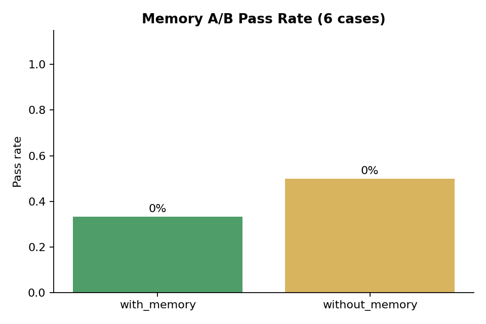
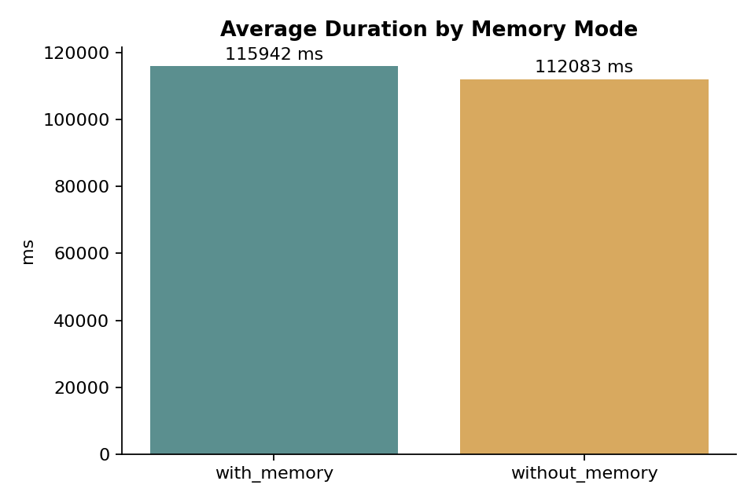
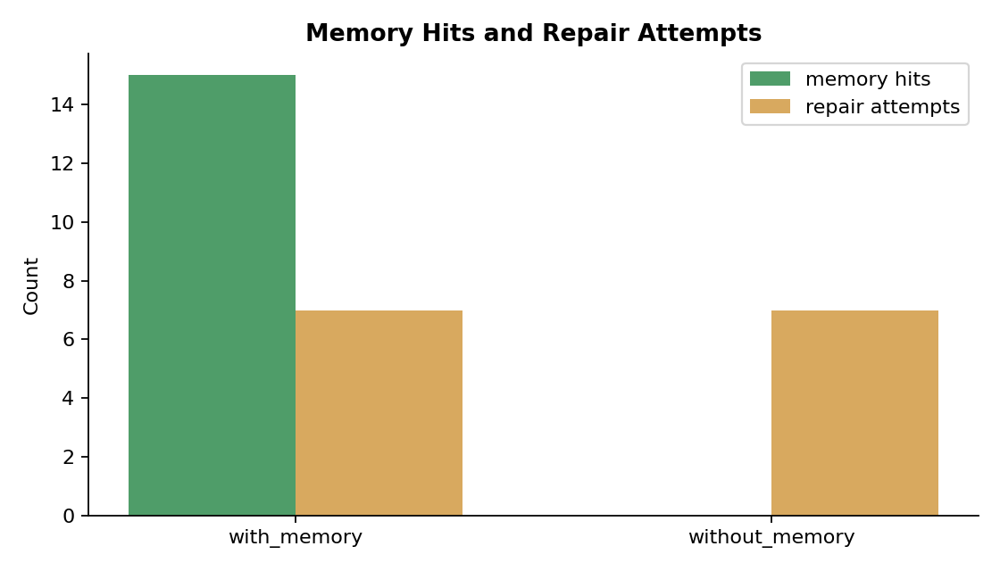
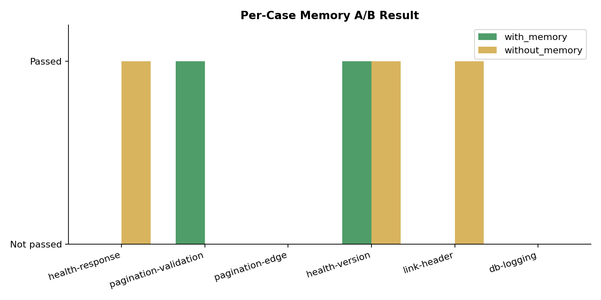

# Memory A/B Test v2 - 6 Cases

Date: 2026-08-08  
Model: `deepseek-v4-flash`  
Embedding: `doubao-embedding-text-240715`  
Repository: `qiangxue/go-rest-api`

## Method

1. Expanded the benchmark suite to 6 cases in `internal/healthcheck`, `pkg/pagination`, and `cmd/server`.
2. Ran one warm-up `with_memory` suite to create historical memory.
3. Ran the actual `with_memory` suite with 6 cases.
4. Ran the actual `without_memory` suite with the same 6 cases.
5. Aggregated only runs from the actual A/B batches.

This run used the fixed async refiner, so batch JSON parsing failures automatically fell back to per-entry refinement.

## Aggregate Results

| Mode | Total | Passed | Pass rate | Avg duration | Memory hits | Repair attempts |
|---|---:|---:|---:|---:|---:|---:|
| `with_memory` | 6 | 2 | 33.3% | 115,942 ms | 15 | 7 |
| `without_memory` | 6 | 3 | 50.0% | 112,083 ms | 0 | 7 |

## Per-Case Results

| Case | with_memory | without_memory |
|---|---|---|
| health-response | Not passed | Passed |
| pagination-validation | Passed | Not passed |
| pagination-edge | Not passed | Not passed |
| health-version | Passed | Passed |
| link-header | Not passed | Passed |
| db-logging | Not passed | Not passed |

## Analysis

- With the fixed refiner, memory now includes `refined_execution_success` and `refined_failure_pattern`, and no refiner failure was observed in the API log.
- `with_memory` produced 2/6 and `without_memory` produced 3/6. The difference is one case, which is not statistically significant.
- Both modes used 7 repair attempts, so memory did not reduce repair effort in this round.
- Memory hits were present only in `with_memory`, as expected.
- The passing cases differ by mode, suggesting run-to-run model variance is a major factor at this sample size.

## Limitations

- 6 cases per mode is still a small sample.
- Tasks ending in `HUMAN_REVIEW_REQUIRED` are counted as not passed, which is conservative.
- Cost and latency limited this to one round per mode.
- Warm-up memory is generated from the same tasks and may include both useful and noisy patterns.

## Raw Data

- `evaluations.json`
- `memory-entries.json`
- `api.log`
- `ab-test.log`
- `ab-test-error.log`
