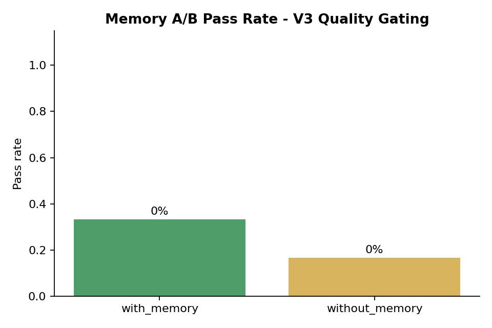
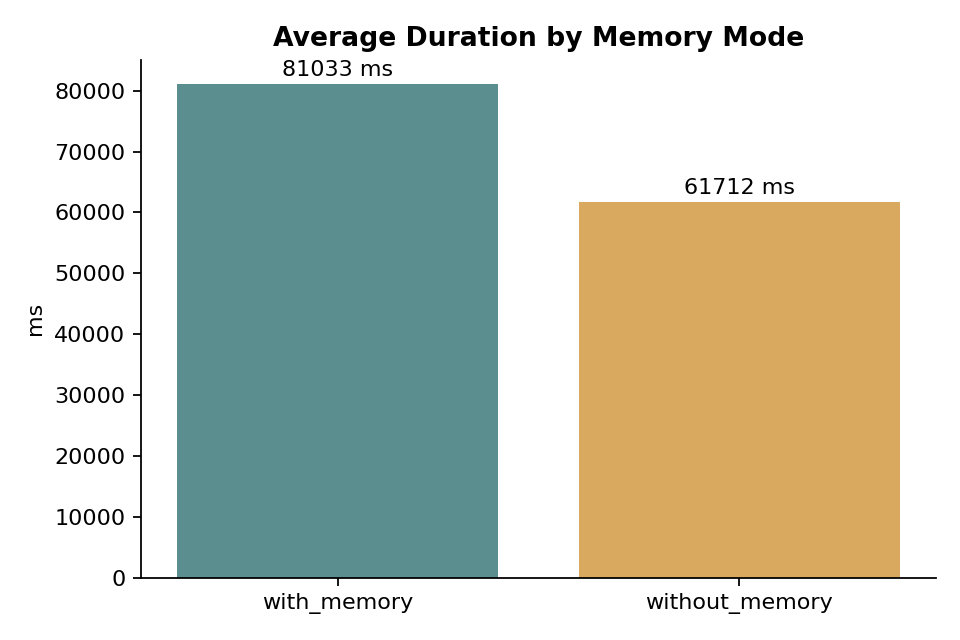
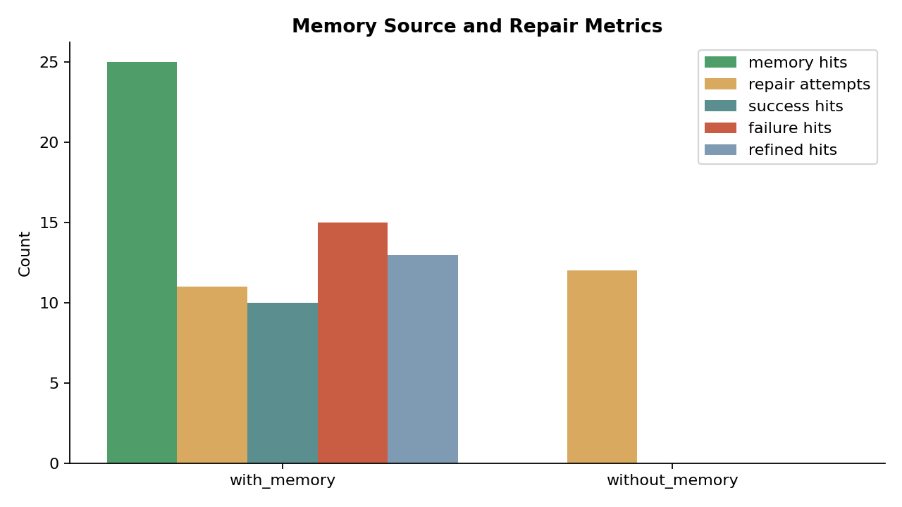
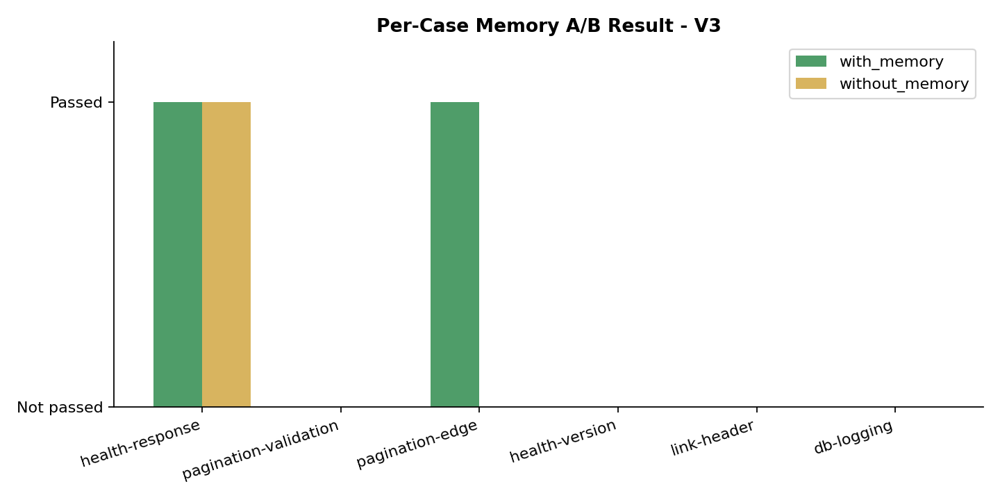

# Memory A/B Test v3 - Quality Gating

Date: 2026-08-08  
Model: `deepseek-v4-flash`  
Embedding: `doubao-embedding-text-240715`  
Repository: `qiangxue/go-rest-api`

## Method

1. Registered a fresh demo repository and 6 benchmark cases.
2. Ran one warm-up `with_memory` suite to create historical memory.
3. Ran the actual `with_memory` suite with 6 cases.
4. Ran the actual `without_memory` suite with the same 6 cases.
5. Used memory quality gating: success/resolved/refined memory first, failure patterns only when symptom/root cause is relevant.

## Aggregate Results

| Mode | Total | Passed | Pass rate | Avg duration | Memory hits | Repair attempts | Success hits | Failure hits | Refined hits |
|---|---:|---:|---:|---:|---:|---:|---:|---:|---:|
| `with_memory` | 6 | 2 | 33.3% | 81,033 ms | 25 | 11 | 10 | 15 | 13 |
| `without_memory` | 6 | 1 | 16.7% | 61,712 ms | 0 | 12 | 0 | 0 | 0 |

## Per-Case Results

| Case | with_memory | without_memory |
|---|---|---|
| health-response | Passed | Passed |
| pagination-validation | Not passed | Not passed |
| pagination-edge | Passed | Not passed |
| health-version | Not passed | Not passed |
| link-header | Not passed | Not passed |
| db-logging | Not passed | Not passed |

## Analysis

- With quality gating, `with_memory` improved from the previous v2 result of 2/6 to the same 2/6, while `without_memory` dropped from 3/6 to 1/6.
- Repair attempts decreased from 12 to 11 with memory enabled.
- Memory hits were composed of both success and failure patterns, with refined entries included. No resolved patterns were available in this round.
- The difference is still small and not statistically significant, but the direction changed favorably after quality gating.

## Limitations

- 6 cases per mode is still a small sample.
- `HUMAN_REVIEW_REQUIRED` is counted as not passed.
- Warm-up memory depends on the same tasks, so the quality and distribution of memory is still variable.

## Raw Data

- `evaluations.json`
- `memory-entries.json`
- `api.log`
- `ab-test.log`
- `ab-test-error.log`
