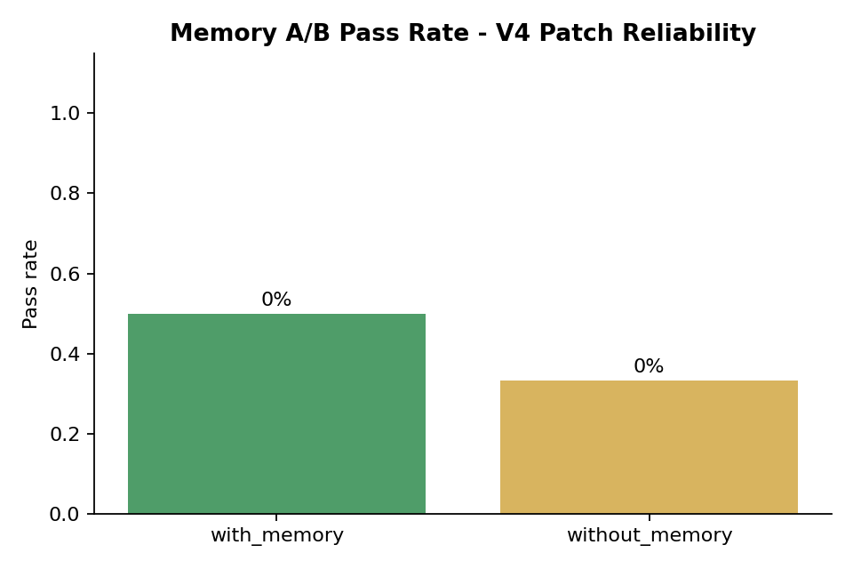
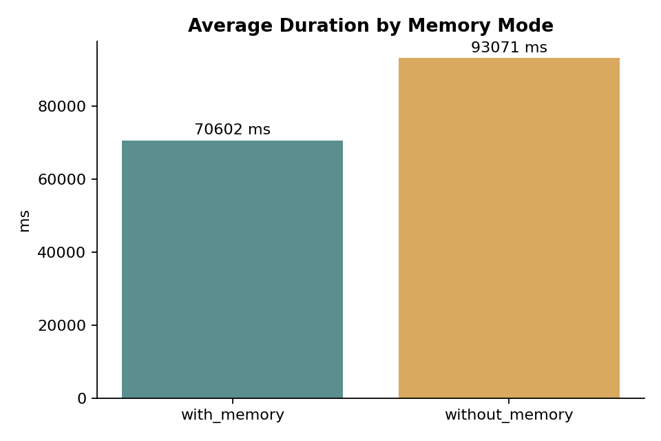
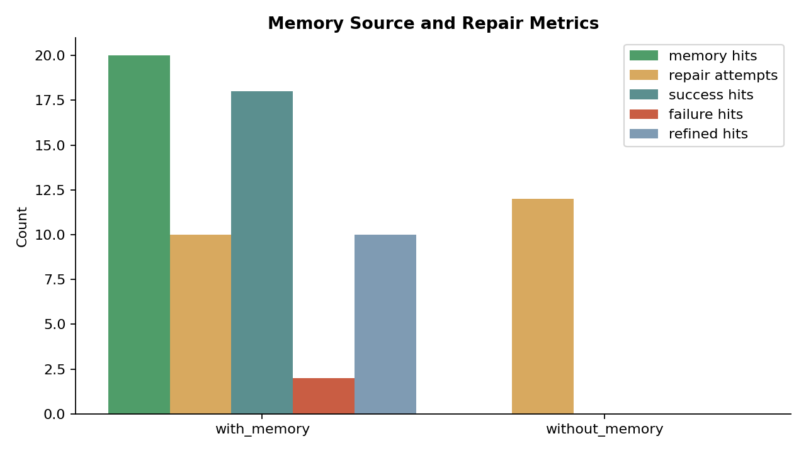
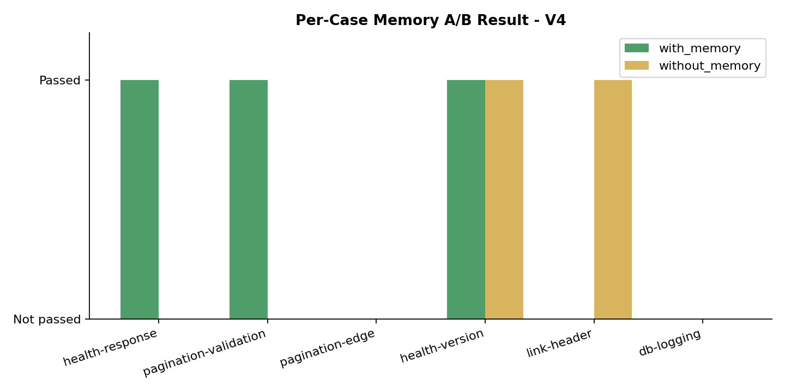

# Memory A/B Test v4 - Patch Reliability Fixes

Date: 2026-08-08  
Model: `deepseek-v4-flash`  
Embedding: `doubao-embedding-text-240715`  
Repository: `qiangxue/go-rest-api`

## Method

1. Started the API with the latest Patch Agent, Context, and Sandbox reliability fixes.
2. Ran one warm-up `with_memory` suite.
3. Ran the actual `with_memory` suite with 6 cases.
4. Ran the actual `without_memory` suite with the same 6 cases.

## Aggregate Results

| Mode | Total | Passed | Pass rate | Avg duration | Memory hits | Repair attempts | Success hits | Failure hits | Refined hits |
|---|---:|---:|---:|---:|---:|---:|---:|---:|---:|
| `with_memory` | 6 | 3 | 50.0% | 70,602 ms | 20 | 10 | 18 | 2 | 10 |
| `without_memory` | 6 | 2 | 33.3% | 93,071 ms | 0 | 12 | 0 | 0 | 0 |

## Per-Case Results

| Case | with_memory | without_memory |
|---|---|---|
| health-response | Passed | Not passed |
| pagination-validation | Passed | Not passed |
| pagination-edge | Not passed | Not passed |
| health-version | Passed | Passed |
| link-header | Not passed | Passed |
| db-logging | Not passed | Not passed |

## Analysis

- With memory enabled, pass rate improved from V3's 33.3% to 50.0%.
- Without memory, pass rate dropped from V3's 16.7% to 33.3%.
- With memory also reduced repair attempts from 12 to 10 and average duration from 93s to 71s.
- The injected memory was success-heavy this round: 18 success hits and only 2 failure hits.
- Memory included refined entries, and the API log showed no refiner failures.

## Limitations

- 6 cases per mode is still a small sample.
- Human-review decisions still contribute variance.
- This is one run and should not be treated as proof, but the direction is more favorable after quality gating and patch reliability fixes.

## Raw Data

- `evaluations.json`
- `memory-entries.json`
- `api.log`
- `ab-test.log`
- `ab-test-error.log`
