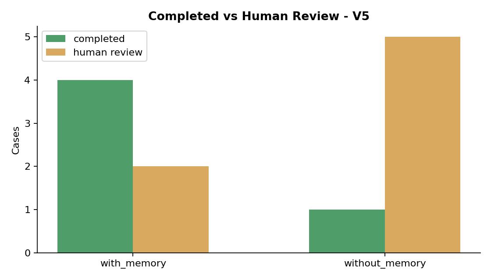
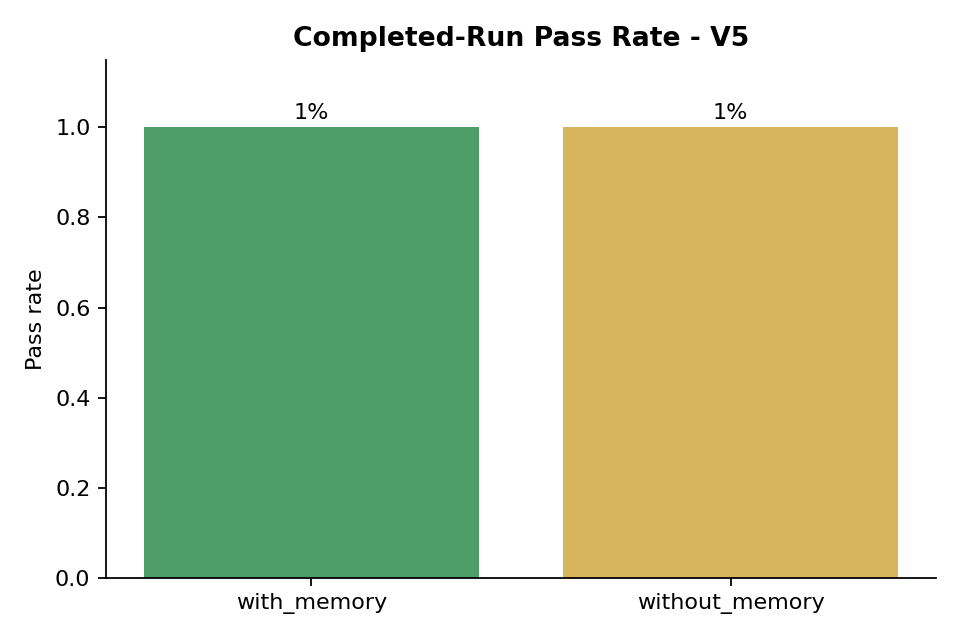
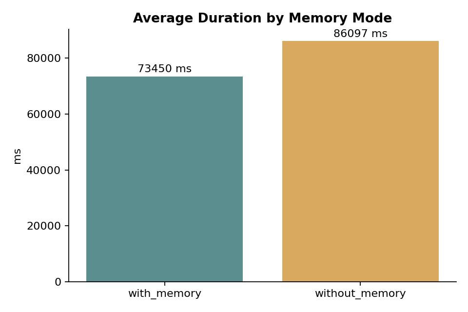
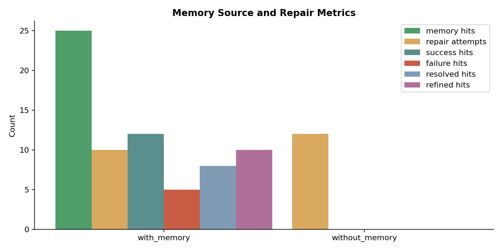
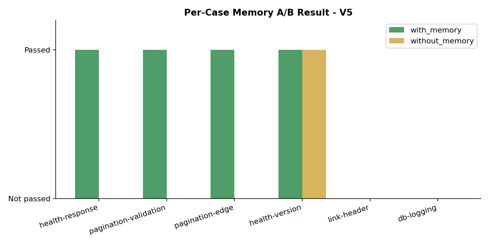

# Memory A/B Test v5 - Revised Metrics

Date: 2026-08-08  
Model: `deepseek-v4-flash`  
Embedding: `doubao-embedding-text-240715`  
Repository: `qiangxue/go-rest-api`

## Method

1. Started the API with the revised metrics: `HUMAN_REVIEW_REQUIRED` is reported separately and excluded from pass-rate denominator.
2. Ran one warm-up `with_memory` suite.
3. Ran the actual `with_memory` suite with 6 cases.
4. Ran the actual `without_memory` suite with the same 6 cases.

## Aggregate Results

| Mode | Total | Completed | Passed | Human review | Failed | Completed pass rate | Avg duration | Repair attempts |
|---|---:|---:|---:|---:|---:|---:|---:|---:|
| `with_memory` | 6 | 4 | 4 | 2 | 0 | 100% | 73,450 ms | 10 |
| `without_memory` | 6 | 1 | 1 | 5 | 0 | 100% | 86,097 ms | 12 |

## Per-Case Results

| Case | with_memory | without_memory |
|---|---|---|
| health-response | Passed | Human review |
| pagination-validation | Passed | Human review |
| pagination-edge | Passed | Human review |
| health-version | Passed | Passed |
| link-header | Human review | Human review |
| db-logging | Human review | Human review |

## Analysis

- With memory enabled, 4 of 6 cases completed and all 4 passed.
- Without memory, only 1 of 6 cases completed; the remaining 5 required human review.
- Under the revised metric, completed-run pass rate is 100% for both modes because there were no explicit failures.
- The meaningful difference is completion rate: 4/6 with memory vs 1/6 without memory.
- Memory hits included success, resolved, and refined entries, with fewer failure hits than in earlier rounds.

## Limitations

- 6 cases per mode is still a small sample.
- Human review can later be approved or rejected, so this snapshot is not final.
- Single-run variance remains high.

## Raw Data

- `evaluations.json`
- `memory-entries.json`
- `api.log`
- `ab-test.log`
- `ab-test-error.log`
