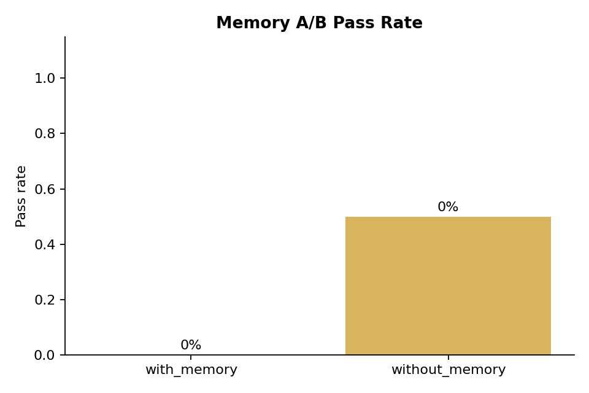
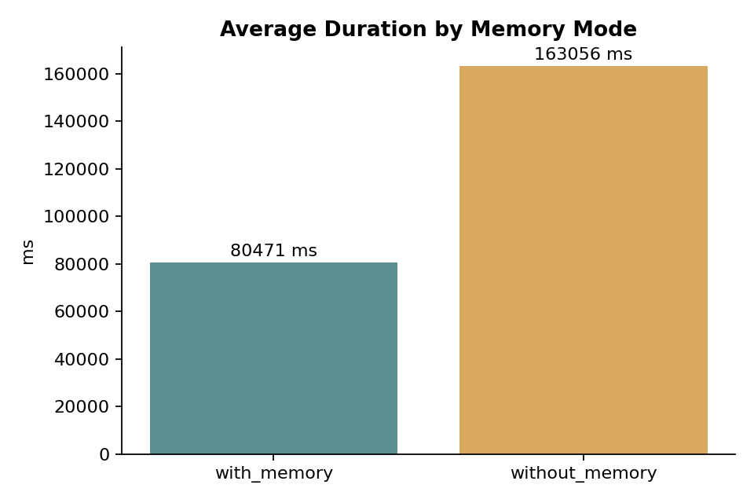
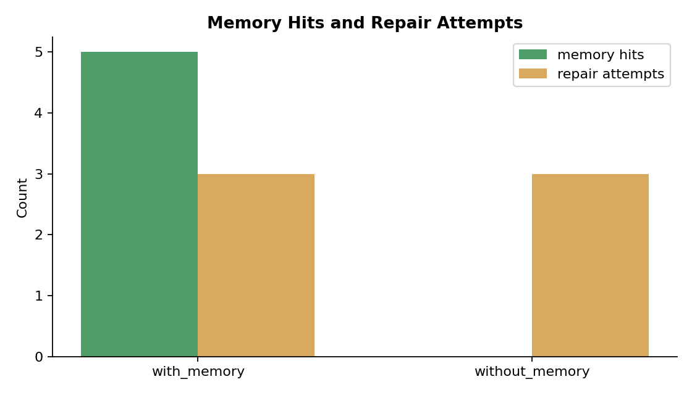

# Real DeepSeek Memory A/B Test

Date: 2026-08-08  
Model: `deepseek-v4-flash`  
Embedding: `doubao-embedding-text-240715`  
Repository: `qiangxue/go-rest-api`

## Method

1. Seed the demo repository and two benchmark cases.
2. Run one warm-up `with_memory` suite so historical memory exists.
3. Run the actual `with_memory` suite.
4. Run the actual `without_memory` suite.
5. Aggregate only runs belonging to the two actual A/B batches.

Both modes use the same benchmark cases, repository state, model, sandbox validation, and review flow. The only controlled difference is memory read/write.

## Results

| Mode | Total | Passed | Pass rate | Avg duration | Memory hits | Repair attempts |
|---|---:|---:|---:|---:|---:|---:|
| `with_memory` | 2 | 0 | 0% | 80,471 ms | 5 | 3 |
| `without_memory` | 2 | 1 | 50% | 163,056 ms | 0 | 3 |





## Raw Data

- `evaluations.json`: full evaluation runs, batches, and metrics.
- `memory-entries.json`: memory entries returned for the A/B repository.
- `api.log`: API startup and runtime logs.
- `ab-test.log`: A/B script progress and final summary.

## Analysis

- `without_memory` produced a higher pass rate in this run, but the sample is only two cases per mode and is not statistically significant.
- All `with_memory` runs ended in `HUMAN_REVIEW_REQUIRED`; one `without_memory` run completed successfully.
- Memory hits were observed only in `with_memory`, as expected.
- The warm-up suite itself did not produce a successful memory; the stored memory is dominated by `failure_pattern` entries. Injecting only failed patterns may have made the model more conservative or steered it toward repeated failure modes.
- A real defect was observed in the async refiner: one batch call returned a single JSON object instead of an array for two inputs, retried three times, and then gave up. This means refined success memory was not available before the A/B runs and the memory corpus remained failure-heavy.
- After this A/B run, the refiner was patched to fall back to per-entry refinement when batch JSON parsing fails. This report records the pre-fix result.
- Because this is a small, single-run comparison, the result should be treated as an A/B framework validation, not as evidence that memory hurts the agent.

## Limitations

- Only two cases were run per mode.
- All `with_memory` tasks required human review, so pass/fail classification depends on the Reviewer behavior and not only patch correctness.
- The warm-up memories are failure-heavy and may not represent high-quality semantic memory.
- Cost and latency limited this to one round of A/B.

## Reproduce

```powershell
.\scripts\memory-ab-test.ps1 -ApiUrl http://127.0.0.1:8081 -WarmUp
```
