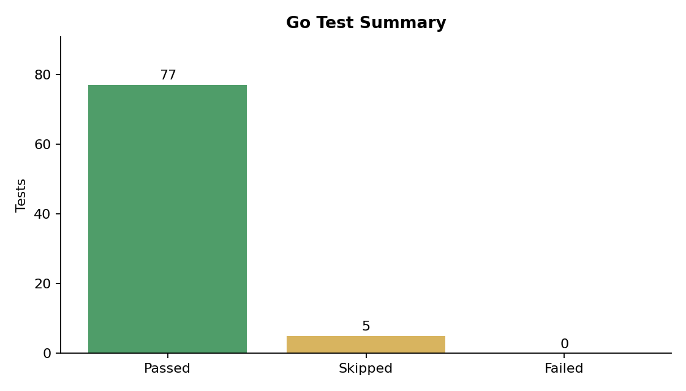
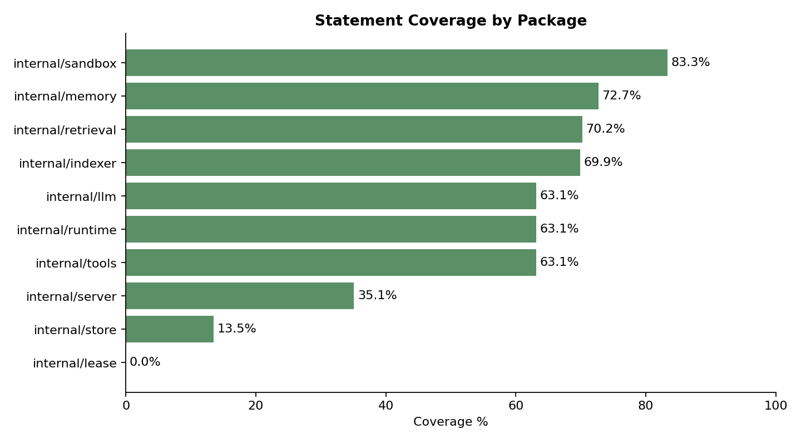
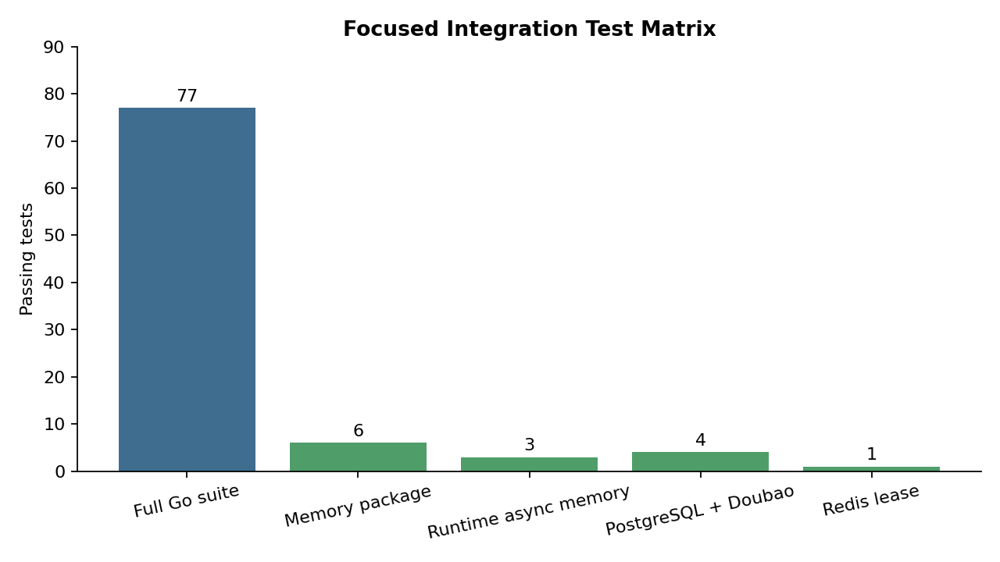

# Test Results

## Summary

| Metric | Value |
|---|---|
| Go tests passed | 77 |
| Go tests failed | 0 |
| Go tests skipped | 5 |
| Go packages passed | 10 |
| Go packages failed | 0 |
| Total statement coverage | 46.9% |



## Package Coverage

| Package | Coverage |
|---|---:|
| internal/sandbox | 83.3% |
| internal/memory | 72.7% |
| internal/retrieval | 70.2% |
| internal/indexer | 69.9% |
| internal/llm | 63.1% |
| internal/runtime | 63.1% |
| internal/tools | 63.1% |
| internal/server | 35.1% |
| internal/store | 13.5% |
| internal/lease | 0.0% |
| Total | 46.9% |



## Focused Integration Matrix

| Area | Passing tests |
|---|---:|
| Full Go suite | 77 |
| Memory package | 6 |
| Runtime async memory | 3 |
| PostgreSQL + Doubao | 4 |
| Redis lease | 1 |



## Integration Tests

### PostgreSQL + Doubao

- `TestPostgresPersistence`: pass
- `TestPostgresVectorMemory`: pass
- `TestPostgresDoubaoMemoryFromEnv`: pass
- `TestPostgresUnrefinedMemories`: pass

### Redis Lease

- `TestRedisLeaserIntegration`: pass

### Memory

- `TestRefineCreatesRefinedMemoryAndLink`: pass
- `TestRefineBatchUsesSingleLLMCall`: pass
- `TestDedupeMarksNearDuplicate`: pass
- `TestConflictCreatesResolvedPattern`: pass
- `TestParseRefinedMemoryHandlesCodeFence`: pass
- `TestUnrefinedMemoriesReturnsOnlyRawCandidates`: pass

### Runtime Memory

- `TestPersistExecutionMemories`: pass
- `TestFailForRunPersistsFailureMemory`: pass
- `TestAsyncMemoryRefinementRecoversOnStart`: pass

## Frontend Build

`npm run build` succeeded:

```text
dist/index.html                   0.46 kB
dist/assets/index-BIscMFaV.css   11.01 kB
dist/assets/index-B1gUsLzZ.js   209.26 kB
```
